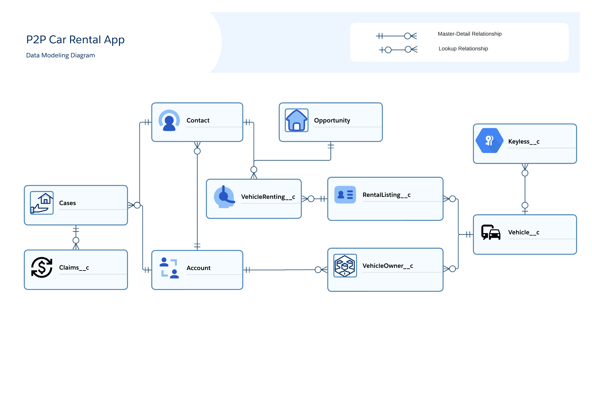
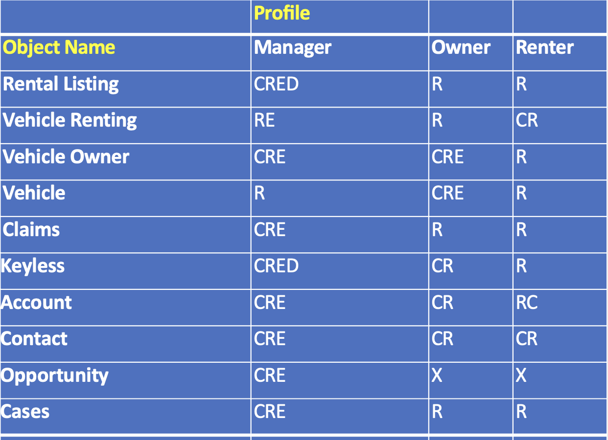

# Triforcia Developer Internship: P2P Car Rental App for Carshare Ventures B.V. (SnappCar)
## Introduction
Welcome to the Triforcia Salesforce app development project for SnappCar, the second-largest car-sharing platform in Europe, has made significant strides since its founding in the Netherlands in 2011. The company is planning to expand its business into the United States. As part of this expansion, SnappCar is looking to leverage Salesforce for managing their car rental processes in the USA operations.

[SnappCar Official Website](https://snappcar.nl/)

## Table of Contents
- [Introduction](#introduction)
- [Problem Statement](#problem-statement)
- [Objects to Create](#objects-to-create)
- [Data Modeling](#data-modeling)
- [Organization Wide Defaults](#organization-wide-defaults)
- [Email Templates](#email-templates)
- [Unit Test Classes](#unit-test-classes)
- [Unmanaged Package](#unmanaged-package)
- [Tasks](#tasks)
- [Project Objectives](#project-objectives)
- [Steps to Solution](#steps-to-solution)
- [Considerations](#considerations)
- [Resources](#resources)
- [Contact Information](#contact-information)

## Problem Statement
SnappCar needs a comprehensive Car Rental Management System that will help them to streamline their rental processes effectively in the US, including:
- Car owner and renter registration
- Car owner's information and keyless car listing management
- Car renter's information and rental process management
- Rental transaction and invoice management

## Objects to Create
**Vehicle Owners**
- Vehicle Name 		Auto Number*
- Account	 		Master-Detail(Account)*				
- isActive			Checkbox			
- Smart Pricing Opt-in 	Checkbox		
- Vehicle 			Master-Detail(Vehicle)*		

**Vehicle Renting**
- Contact			Master-Detail(Contact)*	
- Driving License Number	Text(255)*		
- Extra mile fee		Currency(16, 2)		
- First Odometer Reading	Number(18, 0)*		
- Insurance Fee		Currency(16, 2)		
- isKeyless?		Checkbox	
- Last Odometer Reading	Number(18, 0)		
- Rental Listing		Master-Detail(Rental Listing)*			
- Renting Amount		Currency(16, 2)*
- Renting Type		Picklist(Daily, Hourly)
- Roadside Assistance Fee	Currency(16, 2)	
- SnappCar Fee		Currency(16, 2)	
- Surcharge Fee		Currency(16, 2)
- One-Off Verification Fee Currency (16,2)
- Total Amount		Currency(16, 2)	
- Vehicle Renting ID	Auto Number*	
- Young Driver Fee		Currency(16, 2)

**Vehicle**
- Chassis Number			Text(255)*			
- Condition			Picklist		
- Cyclinder Count			Number(18, 0)		
- Engine Number			Text(255) 	
- Exterior Color			Text(80)		
- Gear Box Type			Text(80)		
- Image				URL(255) 	
- Last Odometer Reading		Number(18, 0) 	
- Odometer Reading Date		Date
- Status				Picklist		
- Vehicle Identification Number	Text(255)* 	
- Vehicle Name			Text(80)	*	
- Vehicle Registration Date		Date

**Rental Listings**
- Rental Listings	
- End Date			Date	
- Extra mile price		Currency(16, 2) 	
- Rate Type		Picklist (Hourly, Daily)	
- isActive			Checkbox*	
- isSmartPrice		Checkbox		
- Long Term Discount	Checkbox	
- Mile Allowance		Number(18, 0) 	
- Price			Currency(16, 2) 	
- Rental Listing ID		Auto Number*	
- Start Date			Date	
- Title			Text(255) 	
- Vehicle			Master-Detail(Vehicle)*

**Claims**
- Case		Master-Detail(Case)*	
- Claim Amount	Currency(16, 2)	
- Claim ID		Auto Number*	
- Documents	URL(255)		
- Final Amount	Currency(16, 2)	
- Payer		Picklist			
- Type		Picklist

**Keyless**
- InUse?		Checkbox			
- Keyless ID	Auto Number*	
- Vehicle		Lookup(Vehicle)

*Required fields
## Data Modeling

## Organization Wide Defaults

Note: This is the initial plan. If you think that an update needed, please feel free to change. But please test it first!
## Profile/Permission Set Settings

C - Create

R - Read

E - Edit

D - Delete

X - No Access 

*Permission Set recommended
Note: This is the initial plan. If you think that an update needed, please feel free to change. But please test it first!

## Email Templates

**Email Template 1**

Subject: Successful Creation of Your Rental Listing

Dear {Vehicle_Owner_Name},

We are pleased to inform you that your rental listing for {Vehicle_Name} has been successfully created on our platform, SnappCar.

You can manage your listing, including setting pricing and availability, directly from your SnappCar dashboard. Should you opt for Smart Pricing, our system will automatically optimize the price of your vehicle based on market demand and other factors.

Your vehicle is now visible to millions of potential renters, providing you the opportunity to monetize your vehicle during the periods it is not in use. 

In case you need any assistance or have queries related to your listing, feel free to reach out to our dedicated owner support team.

Thank you for being a part of the SnappCar community. We appreciate your trust in us and look forward to facilitating successful rentals for your vehicle.

Best Regards,
SnappCar Team

**Email Template 2**

Subject: Successful Vehicle Rental Confirmation

Dear {Renter_Name},

Congratulations! Your vehicle rental for {Vehicle_Name} has been confirmed. We hope this car meets all your requirements and ensures a comfortable ride for you.

Your Rental ID is {Vehicle_Renting_ID}. Please keep this ID for future reference.

Your rental starts from {Rental_Listing_Start_Date} and ends on {Rental_Listing_End_Date}. The total amount for your rental is {Total_Amount}.

Remember, we are here to help you at any time. If you encounter any issues during your rental period, or if you need roadside assistance, please reach out to us immediately. 

We are glad to have you with us and we hope you enjoy your experience with SnappCar. Drive safely!

Best Regards,
SnappCar Team

Please replace the {} placeholders with the respective fields' API names in Salesforce.

## Unit Test Classes

- At least 75% code coverage. Aim to achieve 95%
- Create mock data method with Test Utility Class or Test Setup method
- Use Test.startTest & Test.stopTest
- Cover all possible scenarios

## Unmanaged Package

We strongly encourage you to manually create all the necessary objects and fields. This approach will provide a deeper understanding of the Salesforce schema and data modeling.

However, for those who wish to expedite the setup process, an unmanaged package is available for installation. Here's the link:

[Install Unmanaged App Package](https://login.salesforce.com/packaging/installPackage.apexp?p0=04tHo0000002Ok4&isdtp=p1)

Please note, it's advisable to install this package for Admin only.

As part of the learning experience, some deliberate errors have been included in the setup. We invite you to identify and rectify them as needed. Feel empowered to make adjustments to any object, field, or layout to better suit your project requirements.

## Tasks
[SnappCar -  P2P Car Rental App Tasks (Excel File)](SnappCarr-P2P-CarRental-App-Issues-Triforcia.xlsx)

## At the end of the project, the following topics are to be covered;
- Apex Coding

- Test Classes

- Triggers

- Batch Apex

- Scheduled Apex

- Lightning Web Components

- Security of Production org

- Flow

- Experience Cloud

- Project Management

- Jira Projecect Management Tool

- Git & Github for Version Control System

- VS Code Usage

- Devops Center Usage

- Workbench Usage

## At the end of the project, interns will be able to;
- Design and implement custom objects and fields in Salesforce

- Develop Apex code and test classes to support business requirements

- Create triggers to automate processes and enforce business rules

- Implement batch and scheduled Apex to process data in bulk or at specified times

- Develop Lightning Web Components (LWC) to provide modern user interfaces

- Create screen flows to guide users through complex processes

- Understand and apply Salesforce security features to ensure data privacy and prevent unauthorized access

- Utilize Salesforce Flow to automate and streamline business processes

- Configure and customize Experience Cloud to provide a branded, self-service portal for customers
 
- Manage a project using Jira project management tool and Git & Github for version control system

- Creating Scratch Orgs

- Manage a project using Devops Center

- Deploy metadata via Workbench

- Using and creating unmanagaed packages 

## Steps to Solution
- Step 1: Download or clone project definition from `Clarusway_Cohort4_Developer_Handson` repo on Github 

- Step 2: Create project folder for local public repo on your pc

- Step 3: Install unmanaged package to your developer org 

- Step 4: Complete Administrator implementation tasks  

- Step 5: Write LWC components, Apex triggers, and classes on the VS Code

- Step 6: Create Screen flow alternatives for each LWC component if available 

- Step 7: Deploy your application on developer org using to showcase your app within your team.

- Step 8: Prepeare your presentation on 28th July 2023 at 8 PM

## Considerations
- Feel free to update fields, page layouts, and settings

- Use brand new, never touched developer org(not playground)

## Resources
- [Developer Org Signup](https://developer.salesforce.com/signup)

- [Apex Developer Guide](https://developer.salesforce.com/docs/atlas.en-us.apexcode.meta/apexcode/apex_dev_guide.htm)

- [Lightning Design System](https://www.lightningdesignsystem.com/)

- [Lightning Component Library](https://developer.salesforce.com/docs/component-library/overview/components)

- [Project Presentation File (PDF)](P2PRentalCarApp.pdf)

